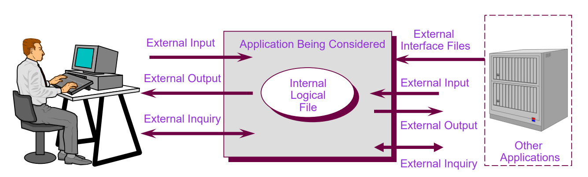

# Estimation for Architects

*By Sachin Dixit*

## Why

- Some idea on time
- Evaluate alternatives
- Fresh development vs Enhancement vs rework/redesign/improvement
- Re-platform!?
- Technology Debt (existing or new addition)

You are expected to give good and useful inputs to Management on estimation, but not the actual estimation (red flag).

## Forces

- Development approach can impact
  - Agile-ish vs Centrally administered (aka waterfall)
  - MVP vs defined scope
- Design alternatives can impact
  - Defined vs evolutionary
- Architectural choice can impact
  - Layered vs componentized vs xyz
  - Monolith vs modular vs SaaS
  - STP vs distributed vs Batch vs UI vs Mobile vs IoT
- Technology choices can impact
  - New vs Established framework
  - Reuse vs Fresh development
  - Rules vs Code vs AI vs federation
- Developers
  - Skill and familiarity
  - Overall developer experience
- Team Topology (distribution of)
  - Skill, experience, cross-role, empowerment

## Soft aspects

- Process (dev-build-test-release-document-support-upgrade etc)
- Culture
- Industry sentiment
- Competition / landscape

## Agile

Taking Scrum as baseline:

- Assumes Devs know best
- Assumes Quality takes time
- Relies on T-shirt sizing
- Velocity as general measure
- Doesn't compare teams
- Assumes heavy collaboration and openness
- Softly assumes fresh development

Might exist in different levels of purity in your scenario.

## Traditional Estimation approaches

- Function Point
- Lines of Code (COCOMO and many more)
- Use case point (feels same as function point)
- Productivity baseline
- Good old S/M/C

## Function Point

- IFPUG and other bodies
- Identify elementary process (user identifiable processing)
- Functions
  - Data functions
    - Internal Logical File (ILF)
    - External Logical File (ELF)
  - Transaction Functions
    - External Input (EI)
    - External Output (EO)
    - External Inquiries (EQ)

Copyright IFPUG

## Calculations

- Data Element Types (DET)
- File Type Referenced (FTR)
- Record Element Type (RET)

Measures of further "stuff" that are part of EI/EO/EQ. Type of Counts: New vs Prototype vs Enhancement. Assign S/M/C numbers to all these. We are skipping the actual process; but you get the idea.

## Calculations (steps)

- Step 1 − Determine the type of count.
- Step 2 − Determine the boundary of the count.
- Step 3 − Identify each Elementary Process (EP) required by the user.
- Step 4 − Determine the unique EPs.
- Step 5 − Measure data functions.
- Step 6 − Measure transactional functions.
- Step 7 − Calculate functional size (unadjusted function point count).
- Step 8 − Determine Value Adjustment Factor (VAF).
- Step 9 − Calculate adjusted function point count.

From: tutorialspoint

## Value Adjustment Factor

Adjust for special needs of your application:

- UI heavy or Batch or API heavy
- Distributed vs Async vs Real Time vs User interrupted
- Performance and Availability commitments
- Reusability vs Configurable vs Customizations
- Upgrade vs Multiversion vs SaaS

**We are skipping the actual calculation process; but you get the idea.**

## Beyond calculation

You may use toy FP for your estimation, but mostly you will be asked for *overall project time end to end*, so include time for…

- Testing: how many types and how long
- Dev Iterations: Review comments, Build fail, library upgrade etc
- User education or Client communication or PO Demos
- Documentation of all kinds (how many can you think of?)
- Installations: Dev/Prod/Test/Perf/Sec, config issues/upgrades
- Ad-hoc enhancements
- Holiday, Slack, Onboarding, resignations, personal issues, Contests…..

## Good Luck
